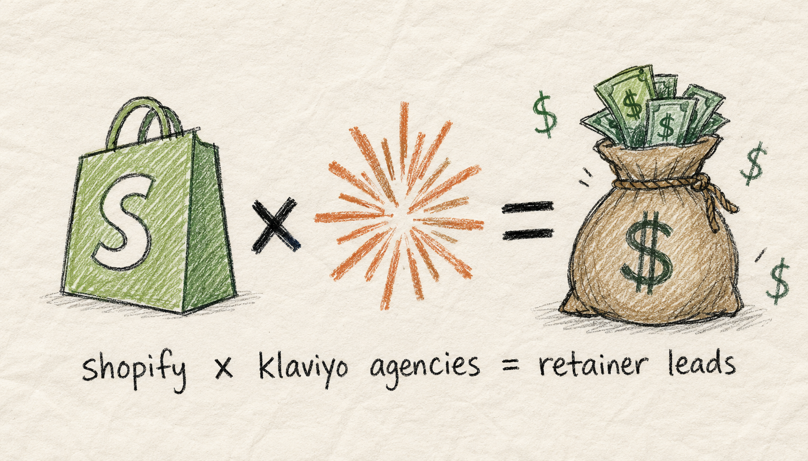
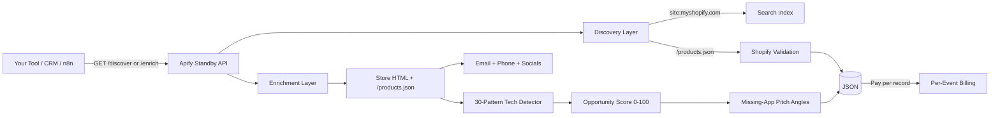

# Shopify DTC Brand Discovery + Tech Stack Filter



[](https://apify.com/george.the.developer/shopify-dtc-brand-discovery?fpr=bbquoh) [](#pricing) [](#use-cases)

Find Shopify stores by niche keyword, see what apps they run, score the opportunity, get pitch angles based on missing app categories. Built for DTC growth agencies running outbound on Klaviyo retainers. Pay per result, no monthly seat license.

Live at: https://apify.com/george.the.developer/shopify-dtc-brand-discovery?fpr=bbquoh

## Why this exists

Every Shopify lead tool gates the data behind monthly seats and stops at basic tech detection. Trendtrack at $99-$299/mo, Store Leads at subscription, the Apify alternatives at 47 monthly users with weak app coverage. DTC agencies don't need a database subscription, they need a query that returns 200 brands with the missing app slot already identified. This is that query.

## What you get per record

```json
{
  "store_url": "https://example.com",
  "brand_name": "Example Co",
  "country": "US",
  "shopify": {
    "product_count": 247,
    "currency": "USD",
    "locales": ["en"],
    "first_product_date": "2024-08-12"
  },
  "tech_stack": {
    "email": ["Klaviyo"],
    "sms": [],
    "reviews": ["Judge.me"],
    "subscriptions": [],
    "helpdesk": [],
    "page_builder": [],
    "upsell": [],
    "loyalty": [],
    "analytics": [],
    "payments": ["Shop Pay", "Shopify Payments"]
  },
  "missing_categories": ["sms", "subscriptions", "helpdesk", "loyalty"],
  "contact": { "email": "hello@example.com", "phone": "+1-555-1234" },
  "socials": {
    "instagram": "https://instagram.com/example",
    "tiktok": null,
    "facebook": null,
    "twitter": null,
    "youtube": null,
    "pinterest": null
  },
  "opportunity_score": 78,
  "pitch_angles": [
    "No SMS app installed - recurring revenue gap from abandoned-cart and post-purchase flows",
    "No subscriptions app - recurring revenue stream untapped"
  ]
}
```

## Architecture



## Endpoints

| Method | Path | Purpose | Charge |
|---|---|---|---|
| GET | `/` | Service info | none |
| GET | `/health` | Health check | none |
| GET | `/discover?keyword=skincare&limit=25` | Discover stores by niche | $0.02 per store |
| GET | `/enrich?store_url=...` | Full enrichment for one store | $0.05 per store |
| POST | `/enrich/bulk` | Up to 50 stores in one call | $0.05 per store |

## Quick start (curl)

```bash
TOKEN="<your-apify-token>"

# Discover 10 skincare brands
curl "https://george-the-developer--shopify-dtc-brand-discovery.apify.actor/discover?keyword=skincare&limit=10" \
  -H "Authorization: Bearer $TOKEN"

# Enrich one specific store
curl "https://george-the-developer--shopify-dtc-brand-discovery.apify.actor/enrich?store_url=https://allbirds.com" \
  -H "Authorization: Bearer $TOKEN"
```

See [examples/](examples/) for Node.js and Python.

## Pricing

| Event | Price | Description |
|---|---|---|
| `discovery-completed` | $0.02 | One Shopify store found and validated against `/products.json` |
| `brand-enriched` | $0.05 | Tech stack detection, contact, socials, opportunity score, and pitch angles |

No subscription. No seat license. Pay only for results returned. Apify free tier covers ~$5/mo of usage out of the gate.

## Use cases

1. **Klaviyo agencies** — find Shopify stores doing $1M+ that DON'T use Klaviyo. Outbound prospecting list with pre-qualified pitch angle ("you have no email tool, here's our retainer").
2. **Postscript / Attentive resellers** — find stores with no SMS app installed.
3. **DTC consultants** — score 500 stores in your niche, sort by opportunity score, work the top 50.
4. **Shopify app developers** — find stores that lack your category. Pre-qualified outbound for product-led growth.
5. **DTC investors / scouts** — discover trending brands by tech stack signals.

## Tech stack detector (v1)

Detects 30 most common DTC apps across 10 categories: Email (Klaviyo, Omnisend, Drip, Mailchimp), SMS (Postscript, Attentive, SMSBump), Reviews (Judge.me, Yotpo, Loox, Stamped, Okendo), Subscriptions (ReCharge, Bold, Skio), Helpdesk (Gorgias, Zendesk, Tidio), Page builder (Shogun, PageFly, GemPages), Upsell (ReConvert, Bold Upsell, Honeycomb), Loyalty (Smile.io, LoyaltyLion, Yotpo Loyalty), Analytics (Triple Whale, Northbeam), Payments (Shop Pay, Shopify Payments, Stripe, PayPal).

v2 expands to 80+ patterns. PRs and feedback welcome via this repo's Issues.

## Honest tradeoffs

- Cold-start latency on first call after idle (~10-30s while Apify wakes the standby actor)
- Tech-stack detection misses headless and Shopify Plus tenants where apps load via custom domains. Coverage is best on standard Shopify themes
- Opportunity score is a heuristic (more apps installed = more saturated buyer = lower score). Tune to your buyer profile
- `/discover` uses search-engine results to find candidate `myshopify.com` URLs; results may vary by region

## License

MIT for the docs and examples in this repo. The actor itself runs on Apify Cloud.
